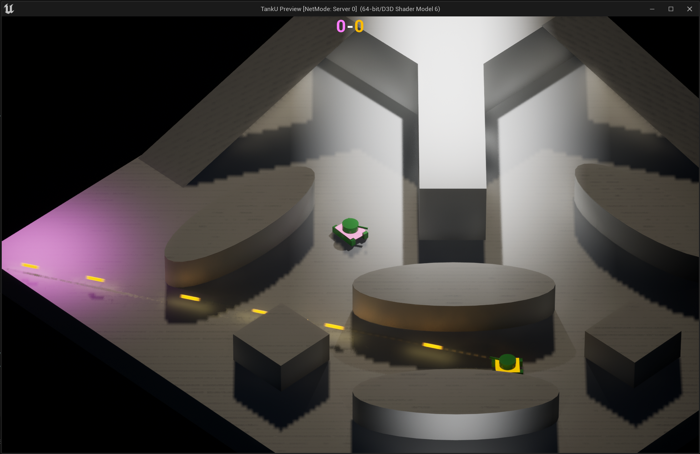
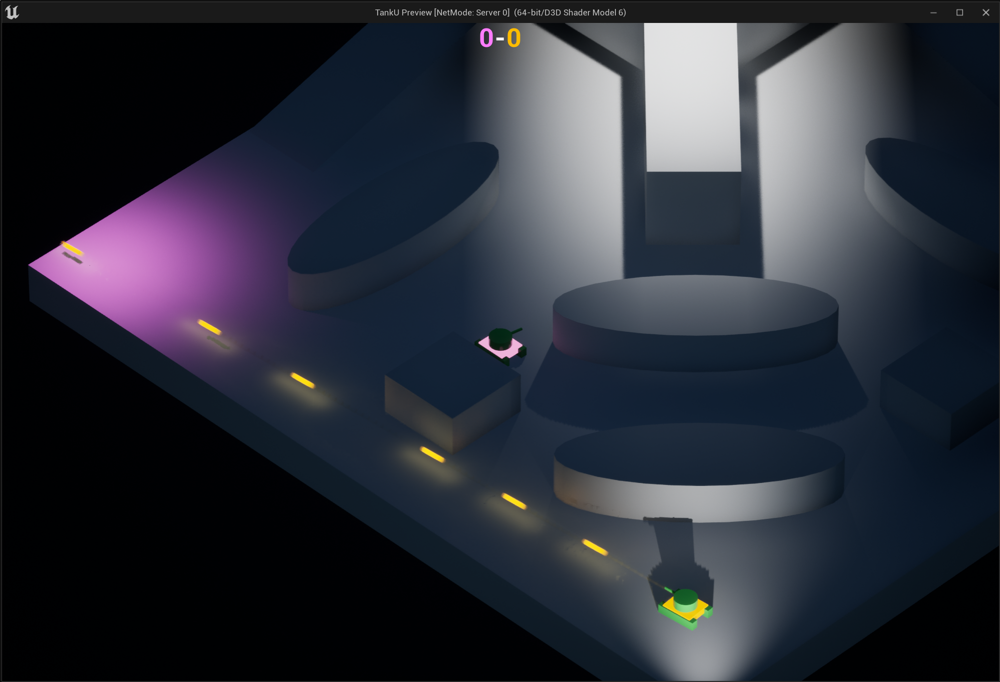

# TankU: UE5 Test Project

TankU is a minimalist 1v1 tank game concept created with Unreal Engine 5.1. This project serves as a test exercise, showcasing basic game mechanics and neon visual styling within a simple environment.

## Overview
- Minimalist 1v1 gameplay setup
- Neon-lit obstacles for a stylized look
- Basic obstacle interaction

## Visuals

